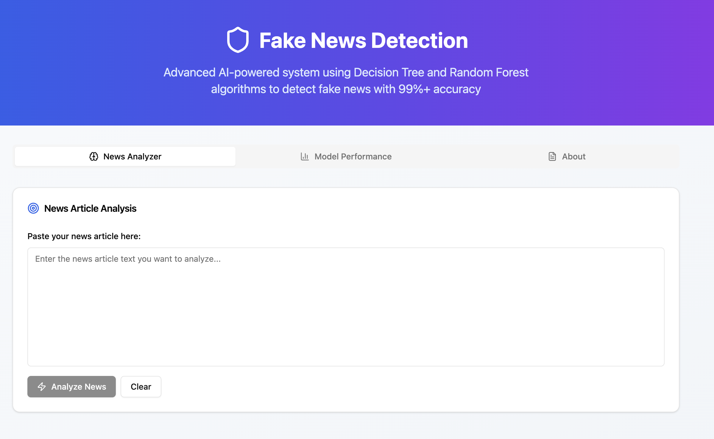

#  Fake News Detection Using Decision Tree & Random Forest

This repository provides a complete solution for detecting fake news using two robust machine learning classifiers: **Decision Tree** and **Random Forest**. Now featuring a slick **Real-Time Frontend Interface** built with **React + TypeScript** for instant predictions and rich model insights.

##  Features at a Glance

- **Machine Learning Backend:** Jupyter Notebook for model training and evaluation (Decision Tree & Random Forest).
- **Modern Frontend UI:** Real-time predictions with clear visual feedback, model comparison, and educational explanations.
- **Kaggle Dataset:** Real & fake news samples for robust model training and testing.

##  Frontend Interface (React + TypeScript)

A modern, mobile-friendly web app providing **real-time predictions** and **interactive model visualizations**!

###  Key Highlights

- **Real-time News Analyzer:** Enter a news article and get instant predictions.
- **Model Comparison:** View accuracy & performance side-by-side.
- **Dual Predictions:** See output + confidence scores from both DT & RF.
- **Visual Metrics:** Precision, recall, and F1-score shown on charts.
- **Educational Layout:** Understand how each model works.
- **Mobile-Responsive:** Works seamlessly on all devices.

###  Tech Stack

- React + TypeScript
- Tailwind CSS & Shadcn UI
- Lucide React Icons
- Vite (blazing-fast dev & builds)

###  Screenshots

### Home Page

- Real-Time Prediction
- Model Comparison

**See the `/screenshots/` directory for snapshots!**

## Project Structure

```
.
├── Frontend/
│   ├── dist/
│   ├── src/                    # React + TypeScript code
│   ├── scripts/
│   ├── index.html
│   ├── tailwind.config.js
│   ├── tsconfig.json
│   ├── package.json
│   └── package-lock.json
├── Screenshots/
│   ├── home-page.png
│   ├── real-time-prediction.png
│   └── model-comparison.png
├── Fake_News_Detection_Using_DT_&_RF.ipynb   # ML backend (Jupyter)
└── README.md
```

## Dataset

- **Source:** Kaggle - [Fake and Real News Dataset](https://www.kaggle.com/datasets/clmentbisaillon/fake-and-real-news-dataset)
- **Files:** `Fake.csv` (fake news), `True.csv` (real news)
- **Labels:** `0` = Fake, `1` = Real

##  Model Overview

- **Decision Tree Classifier:** Splits features to create clear prediction branches.
- **Random Forest Classifier:** Ensemble voting from multiple DTs to reduce overfitting, boost accuracy.
- **Input:** All data preprocessed & **vectorized using TF-IDF**.

##  Model Performance

| Model                   | Accuracy | F1-Score |
|-------------------------|----------|----------|
| Decision Tree           | 99.52%   | 0.99     |
| Random Forest           | 98.89%   | 0.99     |

**Decision Tree Classifier Report:**
```
          precision    recall  f1-score   support
       0       0.99      1.00      1.00      5893
       1       1.00      0.99      0.99      5327
```

**Random Forest Classifier Report:**
```
          precision    recall  f1-score   support
       0       0.99      0.99      0.99      5893
       1       0.99      0.99      0.99      5327
```
> _Final 10 dataset rows held out for “real-world” manual testing._

##  How to Run

###  Backend (Jupyter Notebook)

1. Launch the notebook:
    ```bash
    jupyter notebook Fake_News_Detection_Using_DT_&_RF.ipynb
    ```
2. Upload `Fake.csv`, `True.csv`.
3. Run cells to:
    - Preprocess and vectorize with TF-IDF
    - Train both classifiers
    - Evaluate & view detailed reports

###  Frontend (React App)

1. Enter the `Frontend/` directory:
    ```bash
    cd Frontend
    ```
2. Install dependencies:
    ```bash
    npm install
    ```
3. Start the dev server:
    ```bash
    npm run dev
    ```
4. Visit [http://127.0.0.1:8000](http://127.0.0.1:8000) in your browser for the full UI experience!

##  Requirements

### Python Requirements

- `numpy`  
- `pandas`  
- `scikit-learn`  
- `matplotlib` (optional)
- `seaborn` (optional)

Install with:

```bash
pip install pandas numpy seaborn matplotlib scikit-learn
```

### Node Requirements

- Node.js (v16+)
- npm (v8+)

## Author

**Sahil Samota**

---
